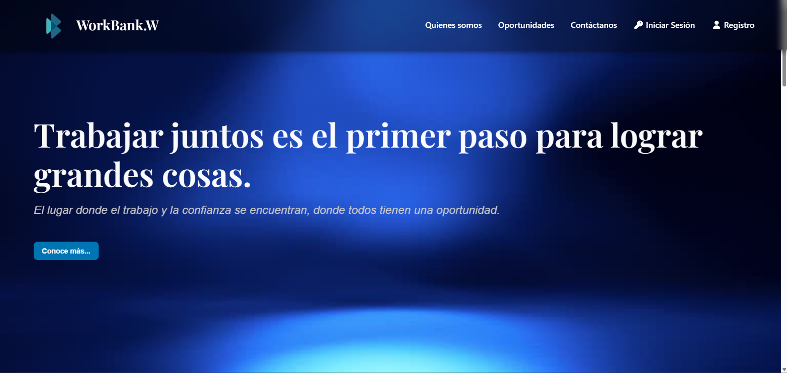
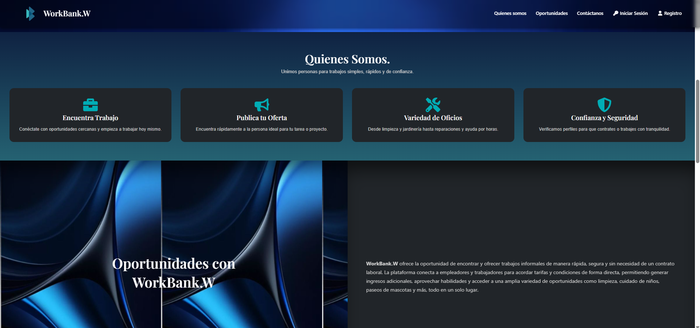
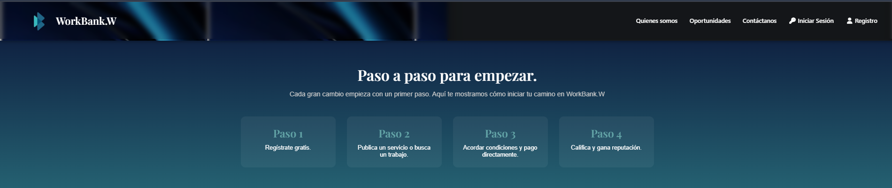
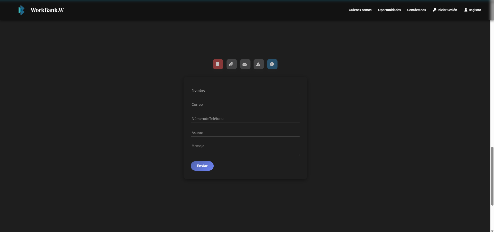

Manual del Usuario/Home
==================

Descripción
-----------

La **página principal (Index)** es el primer punto de interacción del usuario dentro del sistema.  
Su diseño está enfocado en la **usabilidad (UX/UI)**, utilizando una estructura de tarjetas, colores corporativos en tonos azules y tipografía legible (**Roboto** y **Poppins**).

-----------------------------------------------------------
5.1 Descripción General
-----------------------------------------------------------

El **Home** presenta una interfaz limpia e intuitiva que permite al usuario explorar los servicios disponibles, filtrar por categorías y acceder a la información de cada trabajador.

La estructura general incluye:

- **Barra de navegación superior:**  
  Contiene el logo de Work Bank, enlaces a secciones principales (Inicio, Servicios, Contacto) y un botón de cierre de sesión o acceso al perfil.

- **Tarjetas de servicios:**  
  Cada tarjeta muestra información relevante del trabajador o servicio:
  - Nombre del servicio  
  - Categoría  
  - Descripción corta  
  - Precio aproximado  
  - Botón “Ver más” o “Contratar” 

- **Formulario de contactanos**  
  Permite al usuario enviar un correo con una queja o un comentario al correo personal de workbank donde será evaluado y procesado de acuerdo a su proposito.

- **Pie de página (Footer):**  
  Contiene información de contacto, derechos reservados y enlaces a redes sociales o soporte técnico.

-----------------------------------------------------------
5.2 Navegación
-----------------------------------------------------------

El usuario puede desplazarse por la página principal mediante **scroll** vertical.  
Al hacer clic en un servicio o tarjeta, se abrirá una vista detallada con la descripción completa y los datos del trabajador.

El sistema incluye una barra fija superior que mantiene visible el menú principal para facilitar la navegación entre secciones.

-----------------------------------------------------------
5.3 Interacciones Disponibles
-----------------------------------------------------------

- **Buscar un servicio:**  
  Escriba una palabra clave (por ejemplo: “electricista”) en el campo de búsqueda y presione Enter.  

- **Filtrar resultados:**  
  Use los filtros de categoría, precio o ubicación para refinar los resultados mostrados.  

- **Ver detalles del servicio:**  
  Haga clic en el botón “Ver más” dentro de la tarjeta de un servicio para acceder a su descripción completa.  

- **Contratar o contactar al trabajador:**  
  Si el usuario está autenticado como cliente, podrá enviar una solicitud o mensaje directo al trabajador.

-----------------------------------------------------------
5.4 Recomendaciones de Uso
-----------------------------------------------------------

- Mantenga sus datos actualizados en el perfil para mejorar la visibilidad de sus servicios.  
- Verifique la información antes de confirmar una contratación.  
- Use los filtros de búsqueda para optimizar la experiencia y encontrar resultados más relevantes.  
- En caso de error o lentitud, actualice la página o revise su conexión a internet.

-----------------------------------------------------------
6. Cierre de Sesión
-----------------------------------------------------------

El usuario puede cerrar su sesión en cualquier momento desde el menú superior, seleccionando la opción **“Cerrar sesión”**.  
Esto garantiza la seguridad de la cuenta y evita el acceso no autorizado a la información personal.

-----------------------------------------------------------
7. Soporte Técnico
-----------------------------------------------------------

En caso de inconvenientes técnicos o errores en el sistema, comuníquese con el equipo de soporte o el administrador del sistema:

**Correo:** workbank2025oficial@gmail.com  
**Teléfono:** +57 314 393 9007
**Horario de atención:** Lunes a viernes de 8:00 a.m. a 5:00 p.m.

-----------------------------------------------------------
Fin del Documento
-----------------------------------------------------------

