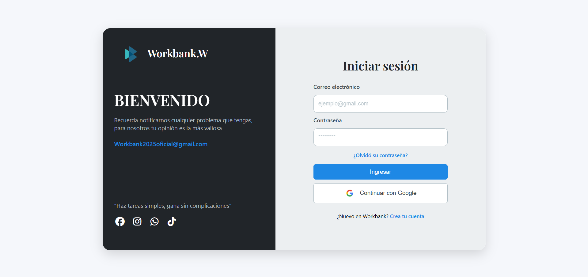

Manual del Usuario/Login
==================

Descripción
-----------

El módulo de inicio de sesión permite a los usuarios autenticarse.

**Ubicación:**  
Pantalla principal del sistema (ruta ``/login``).

**Campos del formulario:**
  - **Correo electrónico:** Campo obligatorio. Debe coincidir con el registrado en el sistema.  
  - **Contraseña:** Campo obligatorio. Debe tener mínimo 8 caracteres.  

**Procedimiento:**
  1. Ingrese a la página de inicio de sesión.  
  2. Digite su **correo electrónico** y **contraseña**.  
  3. Presione el botón **“Iniciar sesión”**.  
  4. El sistema validará las credenciales con la base de datos.  
  5. Si las credenciales son correctas, el usuario será redirigido automáticamente a su **panel correspondiente**:

     - **Administrador:** Dashboard de control (usuarios, servicios, estadísticas).  
     - **Trabajador:** Sección para publicar o editar ofertas laborales.  
     - **Cliente:** Página principal con buscador de servicios y filtros.

**Mensajes del sistema:**
  - “Usuario o contraseña incorrectos” → Si los datos no coinciden.  
  - “Cuenta inactiva” → Si el usuario ha sido deshabilitado por un administrador.  
  - “Inicio de sesión exitoso” → Si las credenciales son correctas.

.. note::
   En caso de olvidar la contraseña, el usuario puede contactar al administrador o usar la opción “¿Olvidaste tu contraseña?” (si está habilitada en la versión actual).

-----------------------------------------------------------
Fin del Documento
-----------------------------------------------------------
